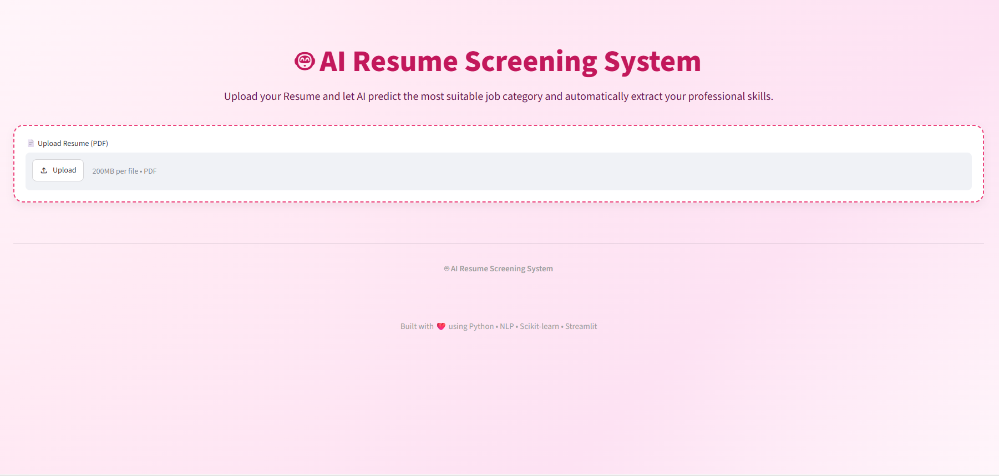
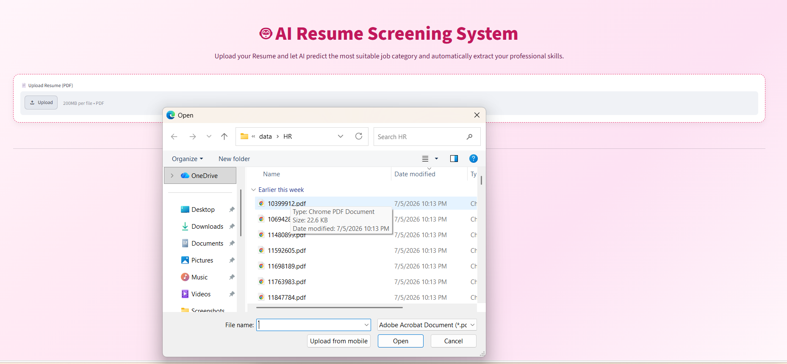
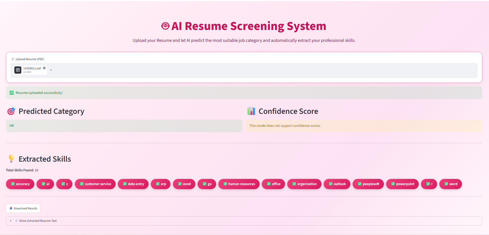
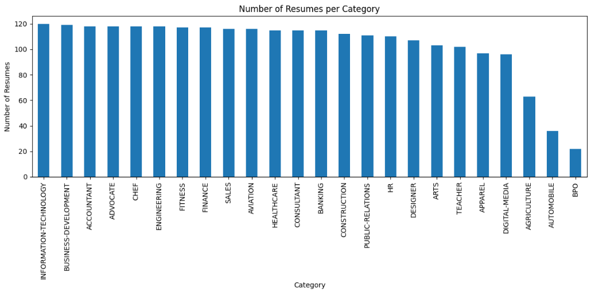
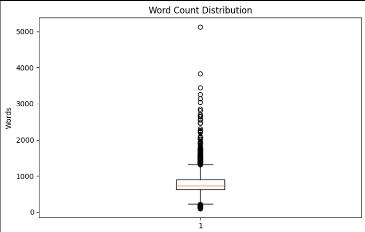
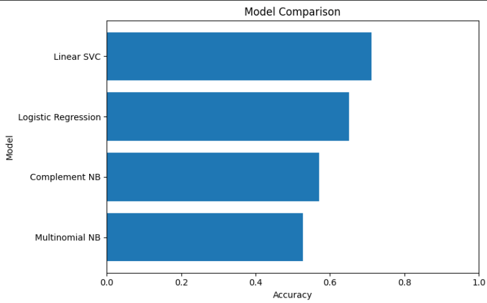
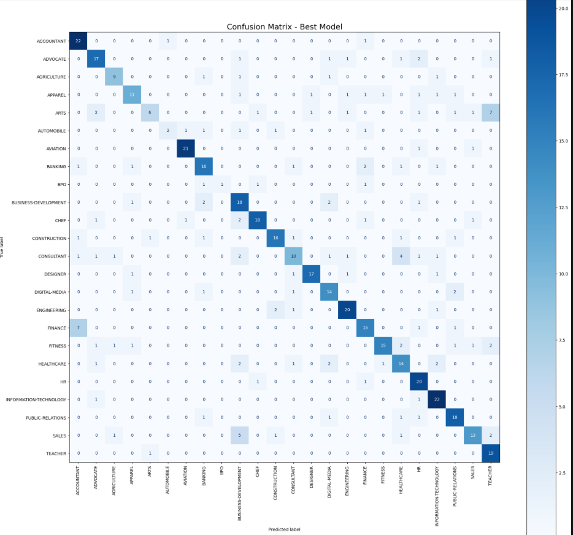

# 🤖 AI Resume Screening System (NLP)

An AI-powered Resume Screening System developed using **Python**, **Natural Language Processing (NLP)**, **Scikit-learn**, and **Streamlit**.

The application automatically classifies uploaded resumes into job categories and extracts technical and professional skills from PDF resumes.

---

# ✨ Features

- 📄 Upload Resume (PDF)
- 🤖 AI-powered Resume Classification
- 💡 Automatic Skills Extraction
- 📑 PDF Text Extraction
- 🎨 Modern Streamlit User Interface
- 📥 Download Prediction Results
- 📃 View Extracted Resume Text
- 📚 250+ Technical & Professional Skills Dictionary

---

# 📸 Project Screenshots

## 🏠 Home Page



---

## 📂 Upload Resume



---

## 🎯 Prediction Result



---

# 📊 Exploratory Data Analysis (EDA)

## 📈 Category Distribution



---

## 📦 Word Count Distribution



---

# 🤖 Model Evaluation

## 📉 Model Comparison



---

## 🎯 Confusion Matrix



---

# 🔄 Project Workflow

1. 📥 Resume Dataset Collection
2. 🧹 Data Cleaning & Preprocessing
3. 📊 Exploratory Data Analysis (EDA)
4. 📝 TF-IDF Text Vectorization
5. 🤖 Machine Learning Model Training
6. 📈 Model Evaluation & Comparison
7. 🏆 Best Model Selection
8. 💻 Streamlit Application Development
9. 📄 Resume Classification
10. 💡 Automatic Skills Extraction

---

# 🧹 Data Preprocessing

The resume dataset was cleaned and prepared before training by:

- ✅ Removing duplicate records
- ✅ Handling missing values
- ✅ Removing punctuation
- ✅ Removing numbers
- ✅ Converting text to lowercase
- ✅ Removing extra spaces
- ✅ Text Tokenization
- ✅ Lemmatization
- ✅ TF-IDF Vectorization

---

# 🧠 Machine Learning Model

Several Machine Learning models were trained and compared.

🏆 **Best Model:** Linear Support Vector Classifier (LinearSVC)

### 📊 Performance

| Metric | Score |
|--------|--------|
| Accuracy | **71.23%** |
| Macro F1 Score | **68.35%** |
| Weighted F1 Score | **70.37%** |

> **Note:** LinearSVC provides excellent classification performance but does not support probability prediction (`predict_proba`), therefore confidence scores are unavailable in the deployed application.

---

# 🛠️ Technologies Used

### 👨‍💻 Programming

- Python

### 📊 Data Analysis

- Pandas
- NumPy
- Matplotlib

### 🤖 Machine Learning

- Scikit-learn
- TF-IDF
- LinearSVC

### 📝 Natural Language Processing

- NLP
- Text Cleaning
- Tokenization
- Lemmatization
- Skills Extraction

### 🌐 Web Application

- Streamlit

### 📄 PDF Processing

- PyPDF

### 💾 Model Deployment

- Joblib

---

# 📂 Project Structure

```text
Resume-Screening-Using-NLP/
│
├── app.py
├── best_resume_classifier_model.pkl
├── requirements.txt
├── README.md
├── resume_clean_dataset.csv
├── images/
│   ├── home_page.png
│   ├── upload_resume.png
│   ├── prediction_result.png
│   ├── category_distribution.png
│   ├── model_comparison.png
│   ├── confusion_matrix.png
│   └── boxplot_word_count.png
│
├── 01_extract_resumes.ipynb
├── 02_eda_analysis.ipynb
├── 03_model_training.ipynb
└── 04_prediction.ipynb
```

---

# 🚀 Installation

Clone the repository

```bash
git clone https://github.com/YOUR_USERNAME/Resume-Screening-Using-NLP.git
```

Install the required packages

```bash
pip install -r requirements.txt
```

Run the application

```bash
streamlit run app.py
```

---

# 🎯 Project Objectives

- Build an AI-powered Resume Screening System.
- Automatically classify resumes using NLP.
- Extract professional skills from uploaded resumes.
- Develop an interactive Streamlit web application.
- Apply Machine Learning to solve a real-world HR problem.

---

# 📌 Future Improvements

- 📄 Support DOCX resumes.
- 📊 Improve prediction accuracy.
- 🤖 Train additional Machine Learning models.
- 🌍 Deploy the application online.
- 🎨 Enhance the user interface.

---

# 👩‍💻 Author

## Sabrin Khater

**Entry-Level Data Analyst | Junior Data Scientist**

📧 Email: sabrynkhatr696@gmail.com

💼 LinkedIn:
https://www.linkedin.com/in/sabrin-data-science

💻 GitHub:
https://github.com/sabrin-data

---

⭐ If you found this project useful, consider giving it a Star.
